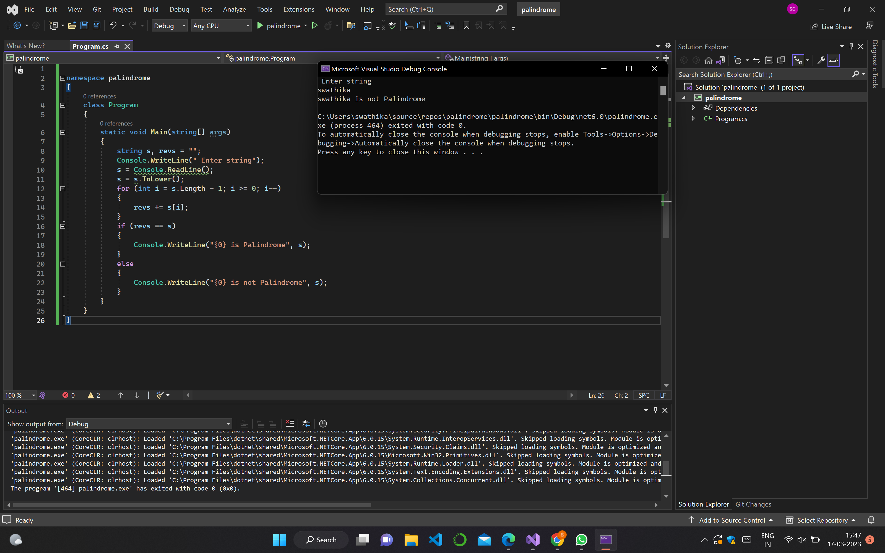
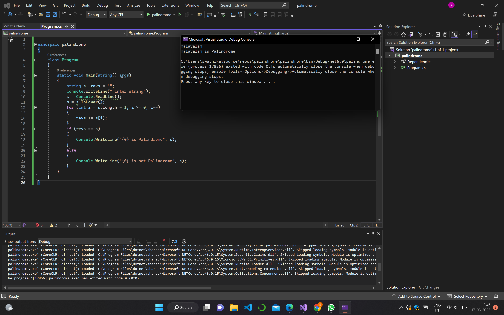

 
# EX-2 Palindrome
### DATE  : 


## Aim:
To write a C# program to find whether the given string is a Palindrome or not.

## Algorithm:
### Step1: 
Start
### Step2:
Create a class and declare two variable with string datatype
### Step3:
Loop over the entire string and reverse it
### Step4:
Use if condition to check whether the string and the reversed string is equal or not
### Step5:
print palindrome if it's equal else print not a palindrome.
### Step6:
stop
<br/><br/><br/><br/><br/><br/><br/>

## Program:
```c#
Name:SWATHIKA G
Reg No:212221230113

using System;
namespace palindrome
{
    class Program
    {
        static void Main(string[] args)
        {
            string s, revs = "";
            Console.WriteLine(" Enter string");
            s = Console.ReadLine();
            s=s.ToLower();
            for (int i = s.Length - 1; i >= 0; i--)
            {
                revs += s[i];
            }
            if (revs == s)
            {
                Console.WriteLine("{0} is Palindrome", s);
            }
            else
            {
                Console.WriteLine("{0} is not Palindrome", s);
            }
        }
    }
}
```

## Output:




## Result:
Thus the C# program to display whether the given string is Palindrome or not is executed successfully.
